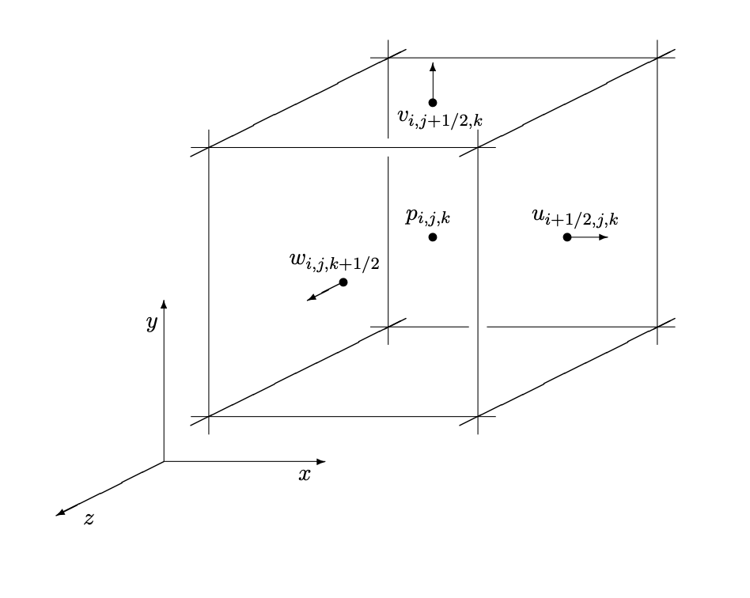
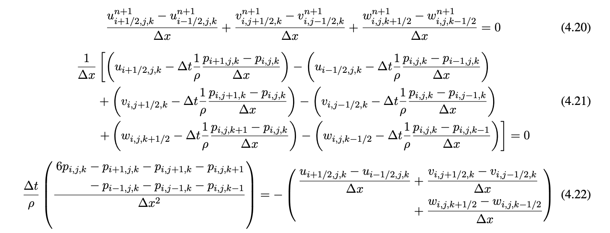
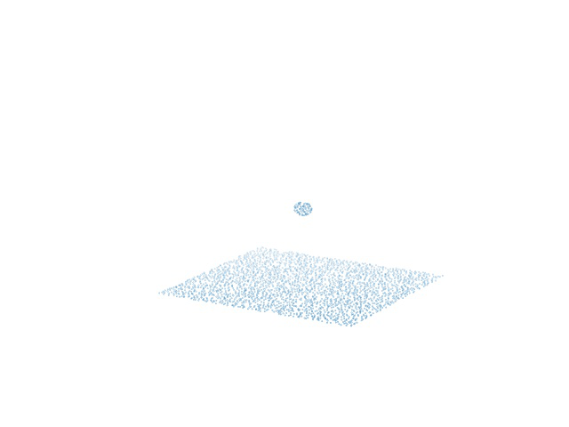

# Fluid Simulation via the Affine Particle-in-Cell Method

## Table of Contents

1. [Proposal](https://alishelton.github.io/184-project-proposal/#proposal)
2. [Milestone](https://alishelton.github.io/184-project-proposal/#milestone)


# Final Report

## Abstract

In this project our goal was to create a 3D APIC fluid simulation by solving for the points frame by frame, and then rendering them. We built off 2D skeleton code from Stanford's CS348C by extending it to 3D and adding in code that enforced the physics equations in APIC. We then used poisson surfacing to generate a mesh from the points, which we then rendered using Mitsuba. Our results produced 2D, 3D, and 3D rendered GIFs of an APIC fluid simulation.

## Technical Approach

### High Level APIC description

APIC is an Eulerian grid based simulation method for physically-based particle simulation. The method itself builds upon earlier methods (PIC and FLIP respectively) by augmenting each particle with a locally affine description of the fluid velocity field. In doing so, APIC reduces overall loss of energy (especially rotational energy) during its velocity update calculation, and remains more stable than previous methods. 

Before we introduce the underlying algorithm behind APIC, it is useful to know the data structures that represent the various qunatities of our fluid. 

### 3-Dimensional Marker-and-Cell Grid 

The main technical driver behind our implementation is a staggered MAC (Marker-and-Cell) grid. The grid is made up of cube cells that store various physical quantities we'd like to calculate. Each cell looks as follows:



We store discrete pressures at the center of each cell and maintain 3 velocity fields. The velocity field u retains information about discrete velocities on the x faces, v on the y faces, and w on the z faces.

The marker portion of the name comes from marking each cell as either an air, water, or solid cell, which is useful for calculating signed distance functions as we'll explain later.

### Particles

Each fluid particle maintains the following information:

- position: Vec3 x_p
- velocity: Vec3 u_p
- locally affine decriptor (x direction): Vec3 cx
- locally affine decriptor (y direction): Vec3 cy
- locally affine decriptor (z direction): Vec3 cz

### Overall Algorithm Pesudocode

```
  particles = initialize_particles()
  For each step in NUM_ITER:
    particles.move_particles()
    particles.transfer_to_grid()
    grid.save_velocities()
    grid.add_forces()
    grid.compute_distance_to_fluid()
    grid.extend_velocity_field()
    grid.apply_boundary_conditions()
    grid.make_fluid_incompressible()
    grid.extend_velocity_field()
    grid.update_velocity_field()
    particles.update_from_grid()
```
  
We'll now go over each step in detail, explaining the involved physical equations along the way

### Particle Initialization

To intialize particles we make use of level sets.

#### Level Sets

Level sets describe an implicit surface on a grid, dictated by the equation:


In our implementation, our choice of function is the signed distance function, whose values describe the implicit surface, and has the additional property that all values within the surface are negative, and all values outside are positive. 

For example, we used the following signed distance function to create the rectangular base of water and a spherical water droplet in our rendered gifs:

`min(y-FLOOR_SIZE*grid.ly, sqrt(sqr(x-0.5*grid.lx)+sqr(y-0.5*grid.ly)+sqr(z-0.5*grid.lz))-DROP_RADIUS*grid.lx)`

### Move Particles

In order to avoid large numerical errors, we use Runge-Kutta 2, a modified Euler method. 

### Particle to Grid Update

We perform all physical calculations on the MAC grid, and so we update the grid with the current particle velocities to begin our particle update. The equation defining particle to grid information transfer follows:


For our purposes, we assume that particle mass does not change, so we assume it is 1 and will ignore it for the rest of our computations. 

The formula then determines the face-centered velocity field updates with particle velocities according to weights w_{aip}. We calculate these weights using the trilinear interpolation kernel.

### Add Forces

To maintain simplicity, the only force we consider is gravity, which is added only to the velocity fields on the grid in the y direction. 

### Compute Distance to Fluid

This function computes the signed-distance function of the fluid level set at any given frame by identifying fluid-marked cells in the grid. We make use of the FSM (Fast Sweeping Method) to calculate the phi values. The equations defined by the FSM determining the function values are as follows:


Since we implement a 3D grid, we solve equation 2.5 at every grid position. Next, FSM follows the logic that signed distance information comes from the closest cells, and there are therefore 8 directions in 3 dimensions we can receive this information from.

### Extend Velocity Field

Next step we extend the velocity field. On our MAC grid, any cell that is marked as fluid will have correspondent velocity fields dictated by the particle velocities we retreieved from the particle to grid update. Solid cells should have 0 velocity. We extrapolate air cell velocities by assigning their values to the velocity field values at the closest fluid-marked cell determined by our signed distance function.

Since we are on a discrete grid, we interpolate among the closest fluid cells in each direction (x, y, z) by calculating the barycentric values of each velocity field for those cells, and update the corresponding velocity fields on the air cell. 

### Apply Boundary Conditions

We assumed a simple cube surrounding the fluid, and so we set the edges (first and last indices) of the grid as solid cells, and set their velocity fields in each direction to 0.

### Making the Fluid Incompressible

To make fluids incompressible we must first understand the equations governing their physical behavior. First, the Navier-Stokes equations of fluid motion:


The first equation (1.1) is known as the momentum equation, and dictates the force transfer among the particles to update the velocity fields. The second equation (1.2) is known as the incompressibility equation. While these equations hold well most fluids, we decided to simplify our implementation further by dropping the viscosity term, resulting in the Euler equations below:


To solve these equations in a discrete space, we calculate the pressure gradients and velocity field divergence:



Equation 4.22 is a numerical approximation to the poisson problem, which we solved by implementing the Modified Incomplete Cholesky Conjugate Gradient (Level 0) Algorithm.

We finally add the pressure gradient we just solved for to the veloctiy fields.

### Grid to Particles Update

Now we transfer the updated grid velocities back to their respective particles. We again use trilinear interpolation to redistribute velocities from cells to particles. 

In addition to updating particle velocities, we also update their locally affine velocity field repsentations using the following equations:


This update reduces energy dissipation during transfers between the particle and the grid and helps maintain simulation stability. We calculate the weight gradient by examining slices of the trilinear interpolation kernal on each cell in each direction (x,y,z). 

### Point Cloud to Mesh Reconstruction

Once we got our point cloud from solving the APIC simulation, we need a way to create a mesh to pass into rendering.  We decided to use Poisson surface reconstruction over other methods (we also considered marching cubes) because it is more stable due to its reslience to noise and is often used for fluid simulation. Poisson surface reconstruction considers all points at once, and casts surface reconstruction as a Poisson problem that uses an indicator function (inside/outside model) and extracts an isosurface. We initially used code from https://github.com/danielTobon43/pointcloudToMesh, choosing the option of creating a triangle mesh rather than a polygon mesh because it works better with other software that we use later on. In our later renders, we wrote a mesh generation script using pclypy and modified parameters to create better meshes.

### Mesh Rendering

We used Mitsuba renderer to create our rendered images. We also used meshlab in order to convert our mesh files to obj files that are readable by Mitsuba. In order for the renders to look like water, we modified the XML file generated from the obj file to have a dielectric bsdf. We also modified the XML file to use pathtracing with russian roulette, as well as fix the camera at a certain point in order to be able to create a GIF from the frames.

### Problems Encountered and Lessons Learned

Early on we encountered lots of bugs with the Stanford starter code as well as not being able to get the APIC equations correct, leading to a less energetic simulation. We dealt with this by breaking the code into pieces, isolating individual parts where the bugs could be occurring and fixing them piece by piece until the overall simulation system worked in 3D. It also helped to create a temporary 3D visualizer to see what parts were not working. For the physics equations, it helped to draw a lot of diagrams and discuss using diagrams how the equations worked before writing it into code. From these problems we learned the importance of understanding the preexisting code we build upon fully in order to expand upon it accurately, as well as having a deep understanding of the paper (APIC) in order to know what we are supposed to see in the preliminary results, as well as be able to derive the correct equations to use in our code. It helped to start with 2D as a simpler case before moving on to 3D.

Later on in the project, we had issues finding programs/software that ran well on our resources, as many graphics related programs seem to use Windows rather than Mac, and many programs would not install due to Clang/OpenMP issues with macOS. Although we managed to find a pipeline to go from points to a rendered image, we learned that it is important to start early on the project and that our life would have been much easier if we took the time to create a efficient pipeline to go from points to rendering rather than doing most steps manually.

## Results

### Early Results

At this stage, APIC and PIC looked nearly identical, as we were working on fixing APIC's affine updates

#### 2D APIC

#### 2D PIC


### Midway Results

At this stage, we'd just managed to get the third dimension working, and could visualize some cool point cloud motion (w/ ~ 25000 particles)

#### 3D APIC
  
#### 3D APIC
  
#### 2D APIC


#### 3D APIC w/ More Particles

Here, we increased the system particle to see what behaviors would arise. While interesting, the number of particles crowded the screen so much of the drop interaction is missed


### First Renders

Here we can see how we go from the point cloud to a mesh


## Contributions from each Team Member

#### Alex Fang

Read papers and helped with doing math to understand how to implement the APIC equations in 3D and in code. Created a 3D visualizer using python's matplotlib in order to help with the debug process. Did research into different types of point to mesh algorithms as well as different types of renders in order to create a pipline through which we can create rendered frames for the fluid simulation from the point cloud outputted by the simulation solver. Helped with brainstorming project ideas, writing project proposal/milestone update, as well as final report.

#### Ali Shelton

Read papers, implemented the 2D to 3D generalization, implemented the APIC equations. Wrote scripts for efficiently converting point clouds to meshes using Point Cloud Library, and rendered the meshes using Mitsuba. Wrote much of the project proposal, milestone, and final report. 

#### Raymond Ly

## References 

Many of these references were vital to our completion of the project, and so we are incredibly grateful for all of the resources made available to us.

### Papers
- https://www.math.ucla.edu/~jteran/papers/JSSTS15.pdf
- https://www.cs.ubc.ca/~rbridson/fluidsimulation/fluids_notes.pdf
- https://www.math.uci.edu/~zhao/homepage/research_files/FSM.pdf
- http://hhoppe.com/poissonrecon.pdf

### Online Resources
- http://www.thevisualroom.com/marker_and_cell_method.html

### Libraries and Code
- http://graphics.stanford.edu/courses/cs348c/PA3_APIC2017/index.html
- https://github.com/danielTobon43/pointcloudToMesh
- http://docs.pointclouds.org/trunk/index.html
- https://github.com/davidcaron/pclpy

### Software
- Mitsuba Renderer
- MeshLab
- Blender


# Milestone

## Accomplishments

So far, most of our effort has gone into the implementation of a 2D APIC simulation via Stanford CS348C. We've implemented the key grid and particle momentum transfer equations that are particular to the APIC implementation. The equations are as follows:


We are currently working on generalizing the code to 3D particle simulation, and from there will move on to surfacing the particle clouds. We have also started work on an OpenGL simulator for running our 3D simulations, as our current simulator is restricted to 2 dimensions. 

## Preliminary Results

Below is an example of our APIC simulation in 2D:


## Progress by Plan

In terms of our initial planning, we had hoped to have a completed PIC and APIC implementation by the end of the second week. Since we are currently using a sample of starter code, a PIC implentation was provided, and we can readily compare that against our APIC implementation. Since the implementation is in 2D however, we are a bit behind. We are also a behind on schedule in terms of the simulator, however we hope to have that running as soon as possible for testing our 3D generalization of the APIC aglorithm. 

## Planning Updates

### Week 1 (Done)

-2D PIC and APIC understanding

### Week 2 (Nearly Done)

- complete APIC implementation
- beginning of a 3D simulation environment

### Week 3

- APIC 3D generlization
- complete 3D simulation environment
- beginning implementation of surface mesh algorithm

### Week 4

- finished implementation of surface mesh algorithm and surace rendering
- final report + optimizations

## Milestone Slides

- https://docs.google.com/presentation/d/1NON9cEiyeiIUWo0XeOZhTuH_BMXTjjbXm8L5d7IDfxU/edit?usp=sharing

## Milestone Video

- https://drive.google.com/file/d/1G6SGieQU5BQz1m61WOORBOVmEE1cxVOG/view?usp=sharing

## Resources

- http://graphics.stanford.edu/courses/cs348c/PA3_APIC2017/index.html
- http://alexey.stomakhin.com/research/siggraph2015_apic.pdf
- http://rlguy.com/gridfluidsim/
- https://github.com/austinEng/WebGL-PIC-FLIP-Fluid/tree/master/demo/shaders
- http://www.thevisualroom.com/marker_and_cell_method.html
- http://plaza.ufl.edu/ebrackear/

# Proposal

## Summary

We intend to design a fluid simulator based on the affine particle-in-cell method. To ensure realism of the simulations, we also intend to render the fluid point-clouds via surface splatting techniques. 

## Team

Alex Fang, Ali Shelton, Raymond Ly

## Problem

Fluid simulation is an active field of research, and developing fluids with realistic physical properties is useful in applications ranging from reasearch into complex ecological systems via simulation to the beautification of contemporary gaming. High fidelity physical properties can be especially important in research, where the results are often dependent on the assumption that the simulation is faithful to some degree to the real scene. The challenge in designing such a simulation methods comes from faithfully representing such a fluid to retain its physical properties without introducing excessive assumptions or noise. 

To provide such a simulation, we turn to the APIC (Affine Particle-in-Cell) method, which builds on the PIC (Particle-in-Cell) and FLIP (Fluid-Implicit Particle) methods to produce a provably more stable simulation that has much lower energy dissipation between steps.

## Goals and Deliverables

### Planned Deliverables

#### Goals

The overall goal of this project can be split into several stages. The first is to provide a realistic particle-based simulation of fluid motion. This includes both the correct physical implementation of the necessary primitives and visualization. The second stage is to provide a realistic texturing to the simulation by generating a surface mesh for each particle update frame and rendering this with the necessary BSDF. Given the information presented in the original [paper](http://alexey.stomakhin.com/research/siggraph2015_apic.pdf) on APIC, we can design and implement such a system with good general direction.  

Our current plan is to make use of the equations presented in the referenced APIC paper, those in the surface splatting paper, and preset BSDFs in blender to implement the simulator. 

#### Reporting

In order to report our deliverables, we will generate a number of small video clips/GIFs of our rendered fluid simulation that will reflect the simulation's key properties (conservation of energy, stability, etc.)

Clips should look similar to the below format direclty from the original [paper](http://alexey.stomakhin.com/research/siggraph2015_apic.pdf)


#### Performance

In simulation systems, performance determines much of what is feasible to produce given our time constraints, and so in order to measure performance in the first stages, we will present graphs designating the time it takes to fully calculate a single simulation step at the particle/grid level. In the second stage, our performance measure are based heavily on the time necessary to produce a sufrace mesh, and then the time to render this mesh with the proper BSDF. We will also provide a graph for speedup analysis of surface mesh production time along with a written analysis of the rendering speedup over the course of the project for any different methods we attempt. 

### Hopeful Deliverables

If time permits, it would be interesting to make the system completely interactive via the project website. We may also include a number of different materials (beyond water) such as ice cream and lava, like those presented in the presentation video for the relevant paper.

## Schedule

Tasks are organized by week

### Week 1

- particle simulation system visualization via OpenGL
- rudimentary PIC (Particle-in-Cell) implementation

### Week 2

- complete APIC implementation
- surface mesh production algorithm implementation

### Week 3

- APIC optimizations
- surface mesh rendering complete/optimizations

### Week 4

- Final report + optimizations

## Resources

### Papers

- http://alexey.stomakhin.com/research/siggraph2015_apic.pdf
- http://mmacklin.com/pbf_sig_preprint.pdf
- https://graphics.uni-bielefeld.de/publications/pbg05.pdf
- https://www.cc.gatech.edu/~turk/my_papers/sph_surfaces.pdf

### Books

- https://developer.nvidia.com/gpugems/GPUGems/gpugems_part01.html

### Computing Platform/Hardware

- RTX 2070 
- Radeon RX 480 

### Software

- OpenGL
- Blender
